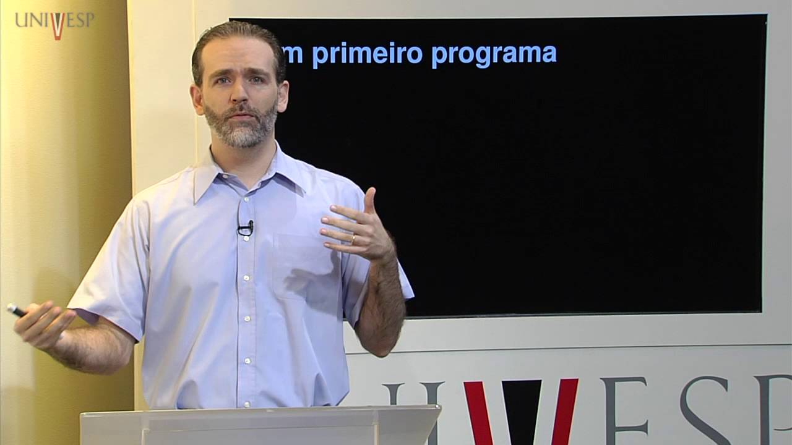

## Engenharia de Computação - Estrutura de Dados UNIVESP

Este diretório contém os exercícios e códigos desenvolvidos durante o curso [Estrutura de Dados (EID-001](https://youtube.com/playlist?list=PLxI8Can9yAHf8k8LrUePyj0y3lLpigGcl&si=Oa92bCydaISznbrq) oferecido pela UNIVESP.

EMENTA:
- Estruturas básicas para representação de informações: listas, árvores, grafos e suas generalizações. 
- Algoritmos para construção, consulta e manipulação de tais estruturas.
- Desenvolvimento, implementação e testes de programas usando tais estruturas em aplicações específicas.

Curso de Engenharia de Computação
Univesp - Universidade Virtual do Estado de São Paulo

Disciplina: Estrutura de Dados (EID-001)

Professor responsável: Norton T. Roman 
Professor ministrante: Luciano A. Digiampietri